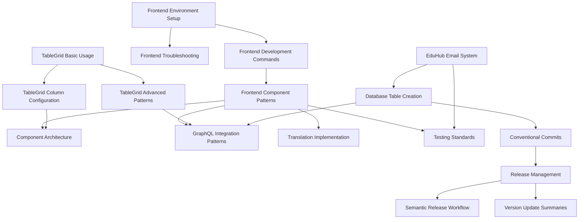

# EduHub Cursor Rules Index

This directory contains comprehensive development rules and guidelines for the EduHub project. Each rule is designed to ensure consistency, quality, and best practices across the codebase.

## Overview Rule

- **[Overview](overview.mdc)**: Core project overview, tech stack, and essential patterns (always applied)

## Rule Categories

### 🎨 Frontend Development
| Rule | Description | Applied When |
|------|-------------|-------------|
| [Frontend Environment Setup](frontend-environment-setup.mdc) | Docker setup, environment configuration, and development environment | Working with Docker, environment setup, or development configuration |
| [Frontend Development Commands](frontend-development-commands.mdc) | Build workflows, testing procedures, and development commands | Working with build processes, testing, or development workflows |
| [Frontend Troubleshooting](frontend-troubleshooting.mdc) | Common issues, Docker problems, and environment fixes | Troubleshooting development environment or Docker issues |
| [Frontend Component Patterns](frontend-component-patterns.mdc) | TypeScript standards, React patterns, and component reuse | Working with TypeScript, React components, or frontend patterns |
| [Component Architecture](component-architecture.mdc) | Component design decisions, organization, and architectural patterns | Designing components, organizing code, or architectural decisions |

### 📊 Data & Tables
| Rule | Description | Applied When |
|------|-------------|-------------|
| [TableGrid Basic Usage](table-grid-basic-usage.mdc) | Basic TableGrid setup, pagination, and page size configuration | Working with data tables, pagination, or basic TableGrid setup |
| [TableGrid Advanced Patterns](table-grid-advanced-patterns.mdc) | useTableGrid hook, GraphQL integration, and complex filtering | Advanced table features, hooks, or complex data filtering |
| [TableGrid Column Configuration](table-grid-column-configuration.mdc) | Column sizing, layout control, and migration from legacy patterns | Configuring table columns, sizing, or migrating table layouts |

### 🔗 GraphQL & Backend
| Rule | Description | Applied When |
|------|-------------|-------------|
| [GraphQL Integration Patterns](graphql-integration-patterns.mdc) | Query/mutation structure, error handling, and caching strategies | Working with GraphQL queries, mutations, or data fetching |
| [Database Table Creation](database-table-creation.md) | Adding new tables, columns, and Hasura metadata configuration | Creating database tables, migrations, or Hasura metadata |

### 🌐 Internationalization
| Rule | Description | Applied When |
|------|-------------|-------------|
| [Translation Implementation](translation-implementation.mdc) | German 'Du' form requirements and component-based organization | Working with translations, i18n, or localization |

### 🌐 Browser & UI verification
| Rule | Description | Applied When |
|------|-------------|-------------|
| [Cursor Browser MCP](cursor-browser-mcp.mdc) | Prefer `cursor-ide-browser`; `user-playwright` as fallback if unavailable | @Browser, UI layout, inspecting localhost (always applied) |


### 🧪 Testing & Quality
| Rule | Description | Applied When |
|------|-------------|-------------|
| [Testing Standards](testing-standards.mdc) | Jest, React Testing Library, and integration testing patterns | Writing tests, test configuration, or testing strategies |

### 📧 Email System
| Rule | Description | Applied When |
|------|-------------|-------------|
| [EduHub Email System](eduhub-email-system.mdc) | Email system configuration and usage patterns | Working with email functionality, templates, or email services |

### 🔐 Security & Performance
| Rule | Description | Applied When |
|------|-------------|-------------|
| [Security and Authentication](security-authentication.mdc) | Security patterns, authentication, authorization, and Keycloak integration | Working with authentication, security, or authorization |
| [Performance Optimization](performance-optimization.mdc) | Performance optimization patterns, caching strategies, and bundle optimization | Optimizing performance, caching, or bundle size |

### 📱 UI/UX Design
| Rule | Description | Applied When |
|------|-------------|-------------|
| [Mobile and Responsive Design](mobile-responsive-design.mdc) | Mobile and responsive design patterns for components, layouts, and TableGrid | Working with responsive design, mobile layouts, or UI/UX |

### 🚀 DevOps & Operations
| Rule | Description | Applied When |
|------|-------------|-------------|
| [DevOps and Monitoring](devops-monitoring.mdc) | DevOps practices, monitoring, logging, deployment, and observability | Working with deployment, monitoring, or DevOps processes |
| [Docker Image Rebuild Guard](docker-rebuild.mdc) | When `docker compose build` / `pull` / `restart` is required so containers don't run a stale image | Changing Dockerfiles, compose image tags, Keycloak providers/version, or serverless function dependencies |

### 🚀 Release Management
| Rule | Description | Applied When |
|------|-------------|-------------|
| [Conventional Commits](conventional-commits.mdc) | Commit message standards and semantic versioning impact | Working with commits, versioning, or release processes |
| [Release Management](release-management.mdc) | Release process, version control, and deployment workflow | Managing releases, version control, or deployment workflows |
| [Semantic Release Workflow](semantic-release-workflow.mdc) | Branch strategy and automated versioning process | Working with branch strategies or automated versioning |
| [Version Update Summaries](version-update-summaries.mdc) | Guidelines for writing user-friendly release announcements | Creating version update summaries for non-technical audiences |

## Quick Start Guide

### For New Developers
1. **Start with**: [Overview](overview.mdc) - Core project understanding
2. **Environment setup**: [Frontend Environment Setup](frontend-environment-setup.mdc)
3. **Learn patterns**: [Frontend Component Patterns](frontend-component-patterns.mdc)
4. **Understand architecture**: [Component Architecture](component-architecture.mdc)
5. **Set up testing**: [Testing Standards](testing-standards.mdc)

### For Frontend Development
1. **Component work**: [Frontend Component Patterns](frontend-component-patterns.mdc) + [Component Architecture](component-architecture.mdc)
2. **Data tables**: [TableGrid Basic Usage](table-grid-basic-usage.mdc) → [TableGrid Advanced Patterns](table-grid-advanced-patterns.mdc)
3. **GraphQL integration**: [GraphQL Integration Patterns](graphql-integration-patterns.mdc)
4. **Translations**: [Translation Implementation](translation-implementation.mdc)
5. **Security**: [Security and Authentication](security-authentication.mdc)
6. **Performance**: [Performance Optimization](performance-optimization.mdc)
7. **Mobile**: [Mobile and Responsive Design](mobile-responsive-design.mdc)

### For Backend Development
1. **Database changes**: [Database Table Creation](database-table-creation.md)
2. **Email functions**: [EduHub Email System](eduhub-email-system.mdc)
3. **Security**: [Security and Authentication](security-authentication.mdc)
4. **Performance**: [Performance Optimization](performance-optimization.mdc)
5. **Testing**: [Testing Standards](testing-standards.mdc)

### For DevOps & Operations
1. **Deployment**: [DevOps and Monitoring](devops-monitoring.mdc)
2. **Releases**: [Release Management](release-management.mdc)
3. **Workflow**: [Semantic Release Workflow](semantic-release-workflow.mdc)
4. **Commits**: [Conventional Commits](conventional-commits.mdc)

### For Release Management
1. **Commits**: [Conventional Commits](conventional-commits.mdc)
2. **Releases**: [Release Management](release-management.mdc)
3. **Workflow**: [Semantic Release Workflow](semantic-release-workflow.mdc)
4. **Announcements**: [Version Update Summaries](version-update-summaries.mdc)

## Rule Relationships



## Rule Metadata Standards

All rules follow a standardized metadata format:

```yaml
---
description: "Brief description of the rule's purpose and scope"
alwaysApply: false
---
```

### Metadata Fields

- **`description`**: Clear, concise description of what the rule covers
- **`alwaysApply`**: Only the overview rule uses `true`; all other rules use `false` for intelligent context-based application

### Intelligent Application

Rules are applied based on context and content analysis rather than file patterns:

- **Context-aware**: Rules activate when working on relevant topics or tasks
- **Content-based**: Rules trigger based on the nature of the work being performed
- **Semantic understanding**: AI determines when rules are relevant to the current task

## Contributing to Rules

### Adding New Rules
1. Create the rule file with standardized metadata
2. Add cross-references to related rules
3. Update this index with the new rule
4. Test the rule triggers appropriately

### Updating Existing Rules
1. Maintain backward compatibility when possible
2. Update cross-references if relationships change
3. Update this index if scope or triggers change
4. Follow the established patterns and structure

### Rule Quality Checklist
- [ ] Clear, actionable content
- [ ] Proper metadata with accurate globs
- [ ] Cross-references to related rules
- [ ] Examples and code snippets
- [ ] Best practices and anti-patterns
- [ ] Consistent formatting and structure

## Troubleshooting

### Rule Not Applying
1. Check if the rule description matches your task context
2. Ensure the rule content is relevant to your specific work
3. Review if the rule scope is appropriate for your task
4. Consider if the task requires a different rule or approach

### Too Many Rules Applying
1. Review rule descriptions and scope
2. Consider if rules are too general or overlapping
3. Split rules if they cover too many different topics
4. Ensure rules are focused on specific domains

### Missing Cross-References
1. Identify related rules
2. Add appropriate cross-references
3. Update related rules to reference back

## Support

For questions about these rules or suggestions for improvements:
1. Check existing rules for similar patterns
2. Review cross-references for related guidance
3. Follow the established patterns and conventions
4. Consider the impact on existing workflows

---

*This index is automatically maintained. Last updated: $(date)*
