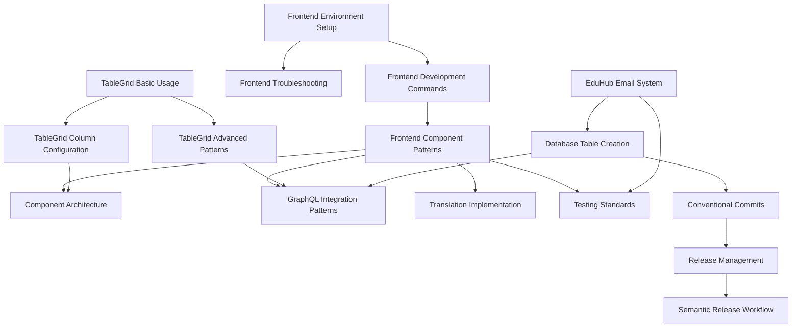

# EduHub Cursor Rules Index

This directory contains comprehensive development rules and guidelines for the EduHub project. Each rule is designed to ensure consistency, quality, and best practices across the codebase.

## Rule Categories

### 🎨 Frontend Development
| Rule | Description | Triggers On |
|------|-------------|-------------|
| [Frontend Environment Setup](frontend-environment-setup.mdc) | Docker setup, environment configuration, and development environment | `docker-compose.yml`, `Dockerfile*`, `frontend-nx/**` |
| [Frontend Development Commands](frontend-development-commands.mdc) | Build workflows, testing procedures, and development commands | `package.json`, `yarn.lock`, `nx.json`, `.github/workflows/**` |
| [Frontend Troubleshooting](frontend-troubleshooting.mdc) | Common issues, Docker problems, and environment fixes | `docker-compose.yml`, `Dockerfile*`, `frontend-nx/**` |
| [Frontend Component Patterns](frontend-component-patterns.mdc) | TypeScript standards, React patterns, and component reuse | `*.ts`, `*.tsx`, `components/**`, `pages/**` |
| [Component Architecture](component-architecture.mdc) | Component design decisions, organization, and architectural patterns | `components/**`, `*.tsx`, `*.ts` |

### 📊 Data & Tables
| Rule | Description | Triggers On |
|------|-------------|-------------|
| [TableGrid Basic Usage](table-grid-basic-usage.mdc) | Basic TableGrid setup, pagination, and page size configuration | `TableGrid/**`, `*table*`, `*grid*`, `components/common/**` |
| [TableGrid Advanced Patterns](table-grid-advanced-patterns.mdc) | useTableGrid hook, GraphQL integration, and complex filtering | `TableGrid/**`, `hooks/**`, `*table*`, `*grid*` |
| [TableGrid Column Configuration](table-grid-column-configuration.mdc) | Column sizing, layout control, and migration from legacy patterns | `TableGrid/**`, `*table*`, `*grid*`, `columns/**` |

### 🔗 GraphQL & Backend
| Rule | Description | Triggers On |
|------|-------------|-------------|
| [GraphQL Integration Patterns](graphql-integration-patterns.mdc) | Query/mutation structure, error handling, and caching strategies | `queries/**`, `hooks/**`, `*.ts`, `*.tsx` |
| [Database Table Creation](database-table-creation.md) | Adding new tables, columns, and Hasura metadata configuration | `migrations/**/*.sql`, `metadata/**/*.yaml`, `queries/**/*.ts` |

### 🌐 Internationalization
| Rule | Description | Triggers On |
|------|-------------|-------------|
| [Translation Implementation](translation-implementation.mdc) | German 'Du' form requirements and component-based organization | `locales/**`, `*translation*`, `*i18n*` |

### 🧪 Testing & Quality
| Rule | Description | Triggers On |
|------|-------------|-------------|
| [Testing Standards](testing-standards.mdc) | Jest, React Testing Library, and integration testing patterns | `*.test.*`, `*.spec.*`, `__tests__/**`, `jest.config.*` |

### 📧 Email System
| Rule | Description | Triggers On |
|------|-------------|-------------|
| [EduHub Email System](eduhub-email-system.mdc) | Email system configuration and usage patterns | `functions/sendMail/**`, `functions/callNodeFunction/**`, `emailTemplates/**` |

### 🔐 Security & Performance
| Rule | Description | Triggers On |
|------|-------------|-------------|
| [Security and Authentication](security-authentication.mdc) | Security patterns, authentication, authorization, and Keycloak integration | `**/auth/**`, `**/keycloak/**`, `hooks/authedMutation.ts`, `**/*auth*` |
| [Performance Optimization](performance-optimization.mdc) | Performance optimization patterns, caching strategies, and bundle optimization | `**/*performance*`, `**/*cache*`, `webpack*`, `next.config.js` |

### 📱 UI/UX Design
| Rule | Description | Triggers On |
|------|-------------|-------------|
| [Mobile and Responsive Design](mobile-responsive-design.mdc) | Mobile and responsive design patterns for components, layouts, and TableGrid | `**/components/**`, `**/styles/**`, `**/*.css`, `**/*mobile*` |

### 🚀 DevOps & Operations
| Rule | Description | Triggers On |
|------|-------------|-------------|
| [DevOps and Monitoring](devops-monitoring.mdc) | DevOps practices, monitoring, logging, deployment, and observability | `.github/workflows/**`, `docker-compose.yml`, `Dockerfile*`, `infrastructure/**` |

### 🚀 Release Management
| Rule | Description | Triggers On |
|------|-------------|-------------|
| [Conventional Commits](conventional-commits.mdc) | Commit message standards and semantic versioning impact | `*.md`, `package.json`, `.releaserc.json`, `CHANGELOG.md` |
| [Release Management](release-management.mdc) | Release process, version control, and deployment workflow | All files |
| [Semantic Release Workflow](semantic-release-workflow.mdc) | Branch strategy and automated versioning process | All files |

## Quick Start Guide

### For New Developers
1. **Start with**: [Frontend Environment Setup](frontend-environment-setup.mdc)
2. **Learn patterns**: [Frontend Component Patterns](frontend-component-patterns.mdc)
3. **Understand architecture**: [Component Architecture](component-architecture.mdc)
4. **Set up testing**: [Testing Standards](testing-standards.mdc)

### For Frontend Development
1. **Component work**: [Frontend Component Patterns](frontend-component-patterns.mdc) + [Component Architecture](component-architecture.mdc)
2. **Data tables**: [TableGrid Basic Usage](table-grid-basic-usage.mdc) → [TableGrid Advanced Patterns](table-grid-advanced-patterns.mdc)
3. **GraphQL integration**: [GraphQL Integration Patterns](graphql-integration-patterns.mdc)
4. **Translations**: [Translation Implementation](translation-implementation.mdc)
5. **Security**: [Security and Authentication](security-authentication.mdc)
6. **Performance**: [Performance Optimization](performance-optimization.mdc)
7. **Mobile**: [Mobile and Responsive Design](mobile-responsive-design.mdc)

### For Backend Development
1. **Database changes**: [Database Table Creation](database-table-creation.md)
2. **Email functions**: [EduHub Email System](eduhub-email-system.mdc)
3. **Security**: [Security and Authentication](security-authentication.mdc)
4. **Performance**: [Performance Optimization](performance-optimization.mdc)
5. **Testing**: [Testing Standards](testing-standards.mdc)

### For DevOps & Operations
1. **Deployment**: [DevOps and Monitoring](devops-monitoring.mdc)
2. **Releases**: [Release Management](release-management.mdc)
3. **Workflow**: [Semantic Release Workflow](semantic-release-workflow.mdc)
4. **Commits**: [Conventional Commits](conventional-commits.mdc)

### For Release Management
1. **Commits**: [Conventional Commits](conventional-commits.mdc)
2. **Releases**: [Release Management](release-management.mdc)
3. **Workflow**: [Semantic Release Workflow](semantic-release-workflow.mdc)

## Rule Relationships



## Rule Metadata Standards

All rules follow a standardized metadata format:

```yaml
---
description: "Brief description of the rule's purpose and scope"
globs: ["**/pattern1/**", "**/pattern2/**", "**/*.ext"]
alwaysApply: true
---
```

### Metadata Fields

- **`description`**: Clear, concise description of what the rule covers
- **`globs`**: Array of file patterns that trigger this rule
- **`alwaysApply`**: Boolean indicating if the rule should be automatically applied

### Globs Patterns

- **`**/components/**`**: All files in components directories
- **`**/*.ts`**: All TypeScript files
- **`**/TableGrid/**`**: All files in TableGrid directories
- **`**/*test*`**: All test-related files
- **`**/migrations/**/*.sql`**: SQL migration files

## Contributing to Rules

### Adding New Rules
1. Create the rule file with standardized metadata
2. Add cross-references to related rules
3. Update this index with the new rule
4. Test the rule triggers appropriately

### Updating Existing Rules
1. Maintain backward compatibility when possible
2. Update cross-references if relationships change
3. Update this index if scope or triggers change
4. Follow the established patterns and structure

### Rule Quality Checklist
- [ ] Clear, actionable content
- [ ] Proper metadata with accurate globs
- [ ] Cross-references to related rules
- [ ] Examples and code snippets
- [ ] Best practices and anti-patterns
- [ ] Consistent formatting and structure

## Troubleshooting

### Rule Not Triggering
1. Check if `alwaysApply: true` is set
2. Verify glob patterns match your files
3. Ensure file paths are correct
4. Check for typos in metadata

### Too Many Rules Triggering
1. Make glob patterns more specific
2. Consider if `alwaysApply: false` is more appropriate
3. Review rule scope and split if too broad

### Missing Cross-References
1. Identify related rules
2. Add appropriate cross-references
3. Update related rules to reference back

## Support

For questions about these rules or suggestions for improvements:
1. Check existing rules for similar patterns
2. Review cross-references for related guidance
3. Follow the established patterns and conventions
4. Consider the impact on existing workflows

---

*This index is automatically maintained. Last updated: $(date)*
