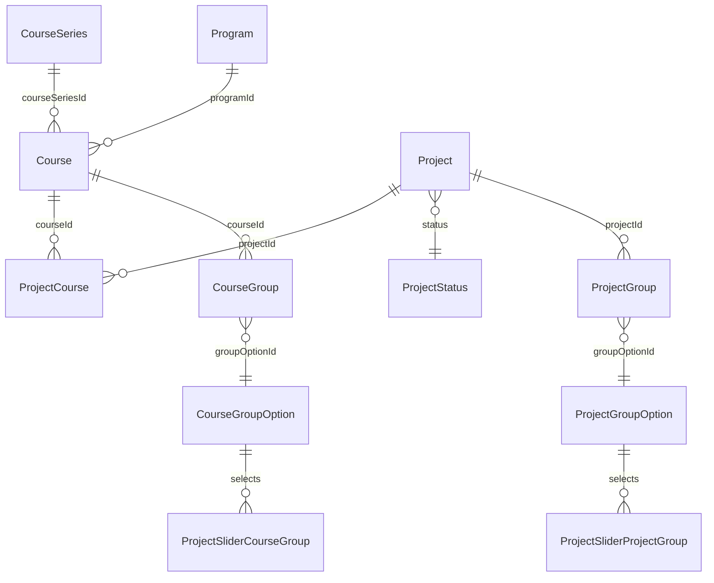

# Project Tile Slider — DB-Level Structure

> **Review decisions (2026-06-28).** This plan was reviewed against `develop` and the
> open questions resolved. The decisions are baked into the sections below; a summary
> lives in [Resolved decisions](#resolved-decisions-2026-06-28) at the end.

## What we reuse (no schema change needed)

Grounded in `develop`:

- Project ↔ Course link: `ProjectCourse` junction (`backend/metadata/databases/default/tables/public_ProjectCourse.yaml`). Program is reached via `Course → Program`. ⚠️ This table has **no `anonymous` select permission today** — see [Change 0](#change-0--anonymous-read-access-required-the-whole-feature-is-public).
- "Currently published projects": `Project.status = 'PUBLISHED'`.
- "Available project templates": `Project.status = 'PROPOSED'` with no `ACCEPTED` `ProjectAuthors`. This matches the existing anonymous visibility rule in `public_Project.yaml`, which gates on **status + no accepted authors only**. `acceptingParticipants = true` is **NOT** part of that permission — apply it as a **query-level** filter when selecting template tiles, not as a permission change.
- "Current vs past programs/courses": `Program.lectureStart` / `Program.lectureEnd`; public visibility = `Course.published && Program.published`.
- Home slider config + ordering pattern: `CourseGroupOption` (`sliderGroup`, `order`, `organizationId`) in `public_CourseGroupOption.yaml`, rendered by `pages/index.tsx`, managed in `ManageAppSettingsContent/CourseGroupOptionsManager.tsx`.

## Change 0 — Anonymous read access (required; the whole feature is public)

The tiles, sliders and project pages all render logged-out, and they traverse
`Project → ProjectCourse → Course (→ CourseGroup / CourseSeries / Program)` plus team
and mentor relations. Several of those reads are **not currently allowed for `anonymous`**.
Fix before anything else:

- **`ProjectCourse`** — has roles `instructor_access` / `user_access` only. Add an `anonymous` `select_permissions` (columns `id`, `projectId`, `courseId`, `created_at`, `updated_at`) filtered to anonymously-visible projects, i.e. `filter: { Project: <project anon visibility> }`. Without this, every "course line", course card, group filter and past-courses query returns empty logged-out.
- **`ProjectMentor`** — current anon filter is `Project.status = PUBLISHED`. **Broaden** it to any anonymously-visible project (PUBLISHED **or** open PROPOSED template) so mentors render on template tiles/pages. `User` is already anon-readable (`filter: {}`, exposes `firstName`/`lastName`/`picture`). *(Decision: mentor is public regardless of project status.)*
- **`ProjectAuthor` / `proposedByUserId`** — leave **unchanged**. Authors stay `PUBLISHED`-only and `proposedByUserId` stays out of the anonymous column set, so team avatars and "Proposed by …" do **not** appear on PROPOSED templates. *(Decision: do not expose author/proposer on templates.)*
- New tables/columns introduced below (`CourseSeries`, `courseSeriesId`, `ProjectGroupOption`, `ProjectGroup`, `CourseGroupOption.contentType`, the two selection junctions) all need anonymous `select_permissions` too.

## Change 1 — Course lineage (enables "projects from past courses")

You chose explicit lineage. Add a durable series identity so "all past iterations of this course" is a single FK lookup (no recursion).

- New table `CourseSeries`: `id` (serial PK), `title text`, `organizationId integer` (FK → `Organization`, nullable), `created_at`, `updated_at`.
- New column `Course.courseSeriesId integer` (FK → `CourseSeries.id`, `ON DELETE SET NULL`, nullable).
- Migration dir under `backend/migrations/default/` (e.g. `{ts}_create_table_public_CourseSeries` + `{ts}_alter_table_public_Course_add_column_courseSeriesId`) with `up.sql` / `down.sql`.
- Hasura metadata: add `public_CourseSeries.yaml`, register in `tables.yaml`, add object relationship `Course.CourseSeries` and array relationship `CourseSeries.Courses`. Add `courseSeriesId` to `Course` anonymous `select_permissions` (slider must work logged-out).
- Optional one-off backfill: group existing courses into series by matching title (data migration; safe to defer).

Past-courses set for course C = courses where `courseSeriesId = C.courseSeriesId` and `Program.lectureEnd < now()`.

Alternative considered: self-referential `Course.predecessorCourseId` (more incremental, but "all past iterations" needs a recursive walk). Recommending `CourseSeries`.

## Change 2 — Project grouping (new, mirrors course groups)

Lets admins tag projects into named groups that a project slider can select.

- New table `ProjectGroupOption`: `id` (serial PK), `title text` (unique), `order integer`, `organizationId integer` (FK → `Organization`, nullable), `created_at`, `updated_at`. Mirrors `CourseGroupOption` (minus `programType`/`sliderGroup`).
- New junction `ProjectGroup`: `id`, `projectId` (FK → `Project`, `ON DELETE CASCADE`), `groupOptionId` (FK → `ProjectGroupOption`), `created_at`, `updated_at`; `UNIQUE(projectId, groupOptionId)`.
- Metadata: add `public_ProjectGroupOption.yaml` + `public_ProjectGroup.yaml`, register in `tables.yaml`, relationships (`Project.ProjectGroups`, `ProjectGroupOption.ProjectGroups`), and anonymous `select_permissions` (sliders are public).

## Change 3 — Configurable project sliders (multiple rows; home placement)

Course pages render their slider automatically (no config). The home page can have
**one or more** configurable project-slider sections, each composing its membership
from selected groups. *(Decision 1c: keep the `CourseGroupOption` overload, but allow
multiple project sliders — there is no "exactly one" constraint and no unique index.)*

- Add `CourseGroupOption.contentType text NOT NULL DEFAULT 'COURSE'` (values `COURSE` | `PROJECT`), optionally FK to a small enum table `SliderContentType`. **Each** row with `contentType = 'PROJECT'`, `sliderGroup = true`, `organizationId IS NULL` is a home project-slider section. Reuses `title`, `order`, the drag-reorder UI and the home render loop in `pages/index.tsx`, so project sliders **interleave by `order`** with course sliders. `programType` is nullable (added post-create) so it is simply left null on PROJECT rows.
- Per-row source-group selection (each project slider picks which groups feed it) via two junctions hanging off that project-slider row:
  - `ProjectSliderCourseGroup`: `projectSliderOptionId` (FK → `CourseGroupOption.id`), `courseGroupOptionId` (FK → `CourseGroupOption.id`).
  - `ProjectSliderProjectGroup`: `projectSliderOptionId` (FK → `CourseGroupOption.id`), `projectGroupOptionId` (FK → `ProjectGroupOption.id`).
- Membership semantics (per project-slider row): if BOTH junctions are empty → all home-eligible projects; otherwise → home-eligible projects belonging to ANY selected course group or project group (union).
- **Home-eligible projects** = PUBLISHED showcases **and** open PROPOSED templates (`status = PROPOSED`, no ACCEPTED authors, `acceptingParticipants = true`). *(Decision 3c: home shows templates too — Tile B surfaces on home, not only Tile A.)*
- **Ordering**: `updated_at` desc, dynamic — no manual per-project curation; newly published/updated projects float up automatically. Lazy-load / paginate inside the slider rather than imposing a hard cap. *(Decision 2d.)*
- Manager (`CourseGroupOptionsManager`): a `PROJECT` row needs a distinct editor (group-selection pickers for the two junctions) instead of the course-group `programType` controls. Multiple PROJECT rows are allowed and reorder alongside course rows.
- Migration + add `contentType` to `public_CourseGroupOption.yaml` anonymous `select_permissions`; add metadata + anonymous perms for the two selection junctions.

Alternative considered: a dedicated standalone `ProjectSlider` table. Rejected so project sliders order/interleave with course sliders via the shared `CourseGroupOption` list.

## Proposed schema (relevant parts)

## Resulting content queries

- **Course page (auto)**, course C in series S:
  - Published: `status=PUBLISHED` AND `ProjectCourses.Course.courseSeriesId = S` AND `Program.lectureEnd < now()`.
  - Templates: `status=PROPOSED` (no ACCEPTED authors, `acceptingParticipants = true` — query-level filter) AND `ProjectCourses.courseId = C`.
- **Home page (each project-slider row)**: home-eligible projects = `status=PUBLISHED` OR (`status=PROPOSED` AND no ACCEPTED authors AND `acceptingParticipants = true`), regardless of `Program.published`, ordered by `updated_at` desc, then:
  - No groups selected → all such projects.
  - Groups selected (CG = chosen course groups, PG = chosen project groups) → projects where `ProjectCourses.Course.CourseGroups.groupOptionId IN CG` OR `ProjectGroups.groupOptionId IN PG`.

## UI design (see `design/project-tile-slider.pen`)

The Pencil frames are illustrative; the notes below reflect the review decisions and
override the mockups where they differ (no type chip, no spots bar, mentor-only).

- **Tile A — Showcase**: published project (status pill, tagline, team avatars, org). **No type chip** — the mockup's "Software/Hardware" chip is dropped (`Project.type` is a requirements profile, not a topic category). *(Decision)*
- **Tile B — Public (no course context)**: CTA "Apply for course". **No type chip; no "N spots" pill.**
- **Tile B — Within course context**: CTA "View & join", course line "Web Development · WS24". **No type chip; no spots pill.**
- **Project Page V1 — Showcase**: full-bleed hero, about section, team stat, similar projects slider, sidebar links/team/mentor/course card. No type chip.
- **Project Page V2 — Public**: horizontal hero split, enroll card ("Apply for course" / "View course"), markdown-split description. **Mentor shown** ("Mentored by …"); **proposer/author not shown** on templates. **No spots bar.** Deadline line (if any) = `Course.applicationEnd`. No bookmark.
- **Project Page V2 — Within course context**: same layout, join card with full-width "Apply to join". **No spots/progress bar.** Deadline = `Course.applicationEnd`. Mentor shown; author not shown on templates. No bookmark.

Context variants: `context: 'public' | 'withinCourse'` from routing (e.g. `/project/[id]` vs `/course/[courseId]/project/[id]`).

## Project discovery surface

*(Decision 3c.)* The home project slider includes PROPOSED templates, so template tiles
(Tile B) are discoverable from the home page rather than only via deep links. A dedicated
public `/projects` index page is **not** in scope for this iteration; the "Projects" nav
entry can stay deferred or point at the home slider.

## Downstream (mandatory workflow, after DB)

- GraphQL: add lightweight `ProjectTileFragment` + documents (course-page + home) in `frontend-nx/apps/edu-hub/queries/`; do NOT reuse the heavy `ProjectFragmentDetailed`. The tile fragment needs: `id`, `title`, `tagline`, `coverImageUrl`, `status`, `organizationId`, `Organization { name }`, `ProjectAuthors { User { firstName lastName picture } }` (avatars, PUBLISHED only), `ProjectMentors { User { firstName lastName picture } }`, and the course context via `ProjectCourses { Course { title Program { shortTitle applicationEnd } } }`. No `type`, no capacity/spots fields.
- Regenerate types: `cd frontend-nx && GRAPHQL_URI=http://localhost:8080/v1/graphql yarn apollo`.
- Frontend tiles: add `ProjectTile` / `ProjectTileWidget` reusing `components/common/TileSlider/TileBase.tsx`; generalize `TileSlider/index.tsx` to accept a discriminated item type (course | project) so home + widget + course pages all reuse it. `pages/index.tsx` must branch on `contentType`: COURSE rows keep the existing course query; each PROJECT row fires the home-projects query above with its group selection.
- Function impact scan: `rg "CourseGroupOption|ProjectCourse|courseSeriesId" functions/`.

## Open assumptions (flag if wrong)

- "Past" is decided by `Program.lectureEnd < now()` (not a manual flag).
- Home project sliders include projects regardless of program publication state (no `Program.published` filter); visibility relies on the anonymous Hasura rule in `public_Project.yaml` (PUBLISHED, or open PROPOSED template).
- Project ordering inside a slider is always `updated_at` desc (no manual curation field).
- Multiple home project sliders are allowed; selecting no groups means "all home-eligible projects", selecting groups narrows to their union.

## Implementation todos

1. **Anonymous perms (Change 0)**: add `anonymous` select on `ProjectCourse`; broaden `ProjectMentor` anon filter to all anonymously-visible projects; leave `ProjectAuthor` / `proposedByUserId` unchanged.
2. Add `CourseSeries` table + `Course.courseSeriesId` FK (migration, metadata, anonymous select perms).
3. Add `ProjectGroupOption` + `ProjectGroup` junction (mirrors course groups).
4. Add `CourseGroupOption.contentType` + project-slider selection junctions (`ProjectSliderCourseGroup`, `ProjectSliderProjectGroup`); allow multiple PROJECT rows (no unique index); add anon perms.
5. Add `ProjectTileFragment` + queries (apply `acceptingParticipants = true` at query level for templates; order by `updated_at` desc; include templates in home membership); regenerate GraphQL types.
6. Add `ProjectTile`/`ProjectTileWidget`; generalize `TileSlider`; wire course page, home (branch on `contentType`), widget. Drop type chip and spots bar in the components; deadline from `Course.applicationEnd`.
7. Extend `CourseGroupOptionsManager` with the PROJECT-row editor (group-selection pickers).
8. Run function impact scan in `functions/`.

## Resolved decisions (2026-06-28)

| # | Question | Decision |
|---|----------|----------|
| Mentor/proposer on templates | Who shows on public (PROPOSED) tiles/pages? | **Mentor public regardless of status; author/proposer not exposed.** |
| Spots/capacity | Source for "N spots" / progress bar? | **Drop the spots bar entirely** (no per-project capacity field added). |
| Apply deadline | Which date drives "Apply by …"? | **`Course.applicationEnd`.** |
| Type chip | What does the category chip show? | **Drop the chip** (`Project.type` is a requirements profile, not a topic). |
| Slider config | Overload `CourseGroupOption` vs dedicated table? | **Keep overload, allow multiple project sliders** (no "exactly one" / unique index). |
| Sort & limit | How are home-slider projects ordered/bounded? | **`updated_at` desc, dynamic; lazy-load, no manual curation.** |
| Discovery surface | Public `/projects` listing page? | **No listing page; home slider includes templates** so Tile B is discoverable. |
| `acceptingParticipants` | Permission vs query? | **Not in the anon permission; apply as a query-level filter for templates.** |
| `ProjectCourse` access | Anonymous traversal? | **Add missing `anonymous` select permission.** |
