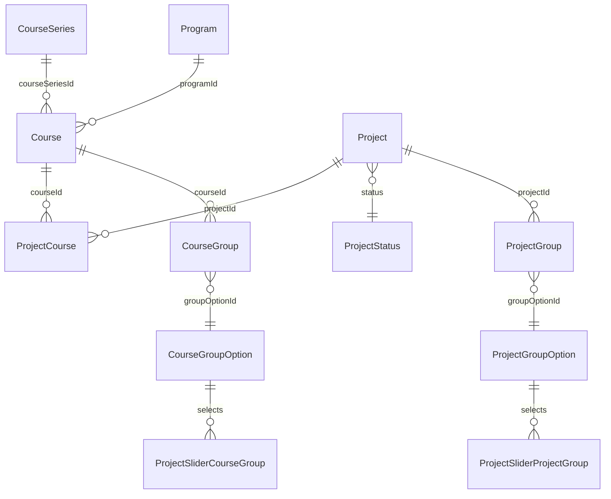

# Project Tile Slider — DB-Level Structure

## What we reuse (no schema change needed)

Grounded in `develop`:

- Project ↔ Course link: `ProjectCourse` junction (`backend/metadata/databases/default/tables/public_ProjectCourse.yaml`). Program is reached via `Course → Program`.
- "Currently published projects": `Project.status = 'PUBLISHED'`.
- "Published / available project templates": `Project.status = 'PROPOSED'` with no `ACCEPTED` `ProjectAuthors` (+ `acceptingParticipants = true`). This is exactly the existing anonymous visibility rule in `public_Project.yaml`.
- "Current vs past programs/courses": `Program.lectureStart` / `Program.lectureEnd`; public visibility = `Course.published && Program.published`.
- Home slider config + ordering pattern: `CourseGroupOption` (`sliderGroup`, `order`, `organizationId`) in `public_CourseGroupOption.yaml`, rendered by `pages/index.tsx`, managed in `ManageAppSettingsContent/CourseGroupOptionsManager.tsx`.

## Change 1 — Course lineage (enables "projects from past courses")

You chose explicit lineage. Add a durable series identity so "all past iterations of this course" is a single FK lookup (no recursion).

- New table `CourseSeries`: `id` (serial PK), `title text`, `organizationId integer` (FK → `Organization`, nullable), `created_at`, `updated_at`.
- New column `Course.courseSeriesId integer` (FK → `CourseSeries.id`, `ON DELETE SET NULL`, nullable).
- Migration dir under `backend/migrations/default/` (e.g. `{ts}_create_table_public_CourseSeries` + `{ts}_alter_table_public_Course_add_column_courseSeriesId`) with `up.sql` / `down.sql`.
- Hasura metadata: add `public_CourseSeries.yaml`, register in `tables.yaml`, add object relationship `Course.CourseSeries` and array relationship `CourseSeries.Courses`. Add `courseSeriesId` to `Course` anonymous `select_permissions` (slider must work logged-out).
- Optional one-off backfill: group existing courses into series by matching title (data migration; safe to defer).

Past-courses set for course C = courses where `courseSeriesId = C.courseSeriesId` and `Program.lectureEnd < now()`.

Alternative considered: self-referential `Course.predecessorCourseId` (more incremental, but "all past iterations" needs a recursive walk). Recommending `CourseSeries`.

## Change 2 — Project grouping (new, mirrors course groups)

Lets admins tag projects into named groups that the home slider can select.

- New table `ProjectGroupOption`: `id` (serial PK), `title text` (unique), `order integer`, `organizationId integer` (FK → `Organization`, nullable), `created_at`, `updated_at`. Mirrors `CourseGroupOption` (minus `programType`/`sliderGroup`).
- New junction `ProjectGroup`: `id`, `projectId` (FK → `Project`, `ON DELETE CASCADE`), `groupOptionId` (FK → `ProjectGroupOption`), `created_at`, `updated_at`; `UNIQUE(projectId, groupOptionId)`.
- Metadata: add `public_ProjectGroupOption.yaml` + `public_ProjectGroup.yaml`, register in `tables.yaml`, relationships (`Project.ProjectGroups`, `ProjectGroupOption.ProjectGroups`), and anonymous `select_permissions` (home slider is public).

## Change 3 — Single configurable home project slider (placement = home only)

Course pages render the slider automatically (no config); the home page has one configurable project slider section whose membership is composed from selected groups.

- Add `CourseGroupOption.contentType text NOT NULL DEFAULT 'COURSE'` (values `COURSE` | `PROJECT`), optionally FK to a small enum table `SliderContentType`. A single row with `contentType = 'PROJECT'`, `sliderGroup = true`, `organizationId IS NULL` IS the home project slider section (reuses `title`, `order`, drag-reorder UI, and the home render loop in `pages/index.tsx`).
- Source-group selection (the admin picks which groups feed the slider) via two junctions hanging off that project-slider row:
  - `ProjectSliderCourseGroup`: `projectSliderOptionId` (FK → `CourseGroupOption.id`), `courseGroupOptionId` (FK → `CourseGroupOption.id`).
  - `ProjectSliderProjectGroup`: `projectSliderOptionId` (FK → `CourseGroupOption.id`), `projectGroupOptionId` (FK → `ProjectGroupOption.id`).
- Membership semantics: if BOTH junctions are empty → all published projects; otherwise → published projects belonging to ANY selected course group or project group (union).
- Migration + add `contentType` to `public_CourseGroupOption.yaml` anonymous `select_permissions`; add metadata + anonymous perms for the two selection junctions.

Alternative considered: a dedicated standalone `ProjectSlider` table. Rejected so the project slider orders/interleaves with course sliders via the shared `CourseGroupOption` list.

## Proposed schema (relevant parts)

## Resulting content queries (no extra Project columns needed)

- **Course page (auto)**, course C in series S:
  - Published: `status=PUBLISHED` AND `ProjectCourses.Course.courseSeriesId = S` AND `Program.lectureEnd < now()`.
  - Templates: `status=PROPOSED` (no ACCEPTED authors, `acceptingParticipants`) AND `ProjectCourses.courseId = C`.
- **Home page (single project-slider row)**: published projects (`status=PUBLISHED`, regardless of `Program.published`), then:
  - No groups selected → all such projects.
  - Groups selected (CG = chosen course groups, PG = chosen project groups) → projects where `ProjectCourses.Course.CourseGroups.groupOptionId IN CG` OR `ProjectGroups.groupOptionId IN PG`.

## UI design (see `design/project-tile-slider.pen`)

- **Tile A — Showcase**: published project (type chip, status pill, tagline, avatars, org).
- **Tile B — Public (no course context)**: CTA "Apply for course".
- **Tile B — Within course context**: CTA "View & join", course line "Web Development · WS24".
- **Project Page V1 — Showcase**: full-bleed hero, about section, team stat, similar projects slider, sidebar links/team/mentor/course card.
- **Project Page V2 — Public**: horizontal hero split, enroll card ("Apply for course" / "View course"), markdown-split description. No bookmark.
- **Project Page V2 — Within course context**: same layout, join card with spots bar and full-width "Apply to join". No bookmark.

Context variants: `context: 'public' | 'withinCourse'` from routing (e.g. `/project/[id]` vs `/course/[courseId]/project/[id]`).

## Downstream (mandatory workflow, after DB)

- GraphQL: add lightweight `ProjectTileFragment` + two documents (course-page + home) in `frontend-nx/apps/edu-hub/queries/`; do NOT reuse the heavy `ProjectFragmentDetailed`.
- Regenerate types: `cd frontend-nx && GRAPHQL_URI=http://localhost:8080/v1/graphql yarn apollo`.
- Frontend tiles: add `ProjectTile` / `ProjectTileWidget` reusing `components/common/TileSlider/TileBase.tsx`; generalize `TileSlider/index.tsx` to accept a discriminated item type (course | project) so home + widget + course pages all reuse it.
- Function impact scan: `rg "CourseGroupOption|ProjectCourse|courseSeriesId" functions/`.

## Open assumptions (flag if wrong)

- "Past" is decided by `Program.lectureEnd < now()` (not a manual flag).
- Home "published projects" includes projects regardless of program publication state (no `Program.published` filter); visibility relies on `status = PUBLISHED` (already public per the anonymous Hasura rule in `public_Project.yaml`).
- Exactly one home project slider section; selecting no groups means "all published projects", selecting groups narrows to their union.

## Implementation todos

1. Add `CourseSeries` table + `Course.courseSeriesId` FK (migration, metadata, anonymous select perms).
2. Add `ProjectGroupOption` + `ProjectGroup` junction (mirrors course groups).
3. Add `CourseGroupOption.contentType` + home project slider selection junctions.
4. Add `ProjectTileFragment` + queries; regenerate GraphQL types.
5. Add `ProjectTile`/`ProjectTileWidget`; generalize `TileSlider`; wire course page, home, widget.
6. Run function impact scan in `functions/`.
